SA\_Assignment5
================
Peter Thramkrongart & Jakub Raszka
2 3 2021

## Kazanlak Valley Analysis

### Intro

At the very beginning, we would like to say that we haven’t completed
the whole assignment. It turned out to be quite demanding assigment so
we decided to focus solely on the supervised classification. Also, don’t
forget to read the instructions for the task 3. The main question to be
answered is how much ground area is covered with the fields of roses.
<https://worker02.chcaa.au.dk/rstudio/files/R/spatial-analytics-forked/cds-spatial/Week05/HW05/Week05_homework.html>

A quick outline of the assignment follows:

  - loading and aligning the data
  - visualizing and getting the feel for the data
  - commented out attempts of unsupervised classification
  - supervised classification with random forest
      - training a model only on the data obtained from the field work
        of the east part (west was completely kept for testing the
        model)
      - classifying the east
      - testing the model on the west part of the valley
  - explaining what did go wrong

### Data & Packages

Below you can find a code for downloading the data from the html
addreseses. As the data needs to be downsampled to reduce its size,
clouds have computational capacities as well, we commented the code out
along with the downsampling (aggregate function) and saved the
downsampled data instead

``` r
# Packages
pacman::p_load(pacman,tidyverse,raster,sf,tmap, utils, randomForest,RColorBrewer)

# dowloading data from the website
#download.file("https://sciencedata.dk/public/104dc1b7a08529650379d858979ae104/KazWestfused.tif","KazWestfused.tif")
#download.file("https://sciencedata.dk/public/104dc1b7a08529650379d858979ae104/KazEastfused.tif","KazEastfused.tif")

# loading data
east_raw <- brick("KazEastfused.tif")
west_raw <- brick("KazWestfused.tif")


#downsampling by a factor of 10
# east <- raster::aggregate(east_raw, fact = 10)
# west <- raster::aggregate(west_raw, fact = 10)

# Saving data so we don'´t have to run it again and again...
# east %>% writeRaster("eastImage.tif")
# west %>% writeRaster("westImage.tif")

# loading raster data with 4 different layers (red, green, blue, near infra light)
east <- brick("eastImage.tif")
west <- brick("westImage.tif")


# loading data with labels of areas obtained through field work which is used for the classification
kaz_units <- st_read("data/KAZ_units.shp")
```

    ## Reading layer `KAZ_units' from data source `/home/cds-au604148/R/spatial-analytics-forked/cds-spatial/Week05/HW05/data/KAZ_units.shp' using driver `ESRI Shapefile'
    ## Simple feature collection with 7708 features and 26 fields (with 1 geometry empty)
    ## geometry type:  MULTIPOLYGON
    ## dimension:      XY
    ## bbox:           xmin: 352181.7 ymin: 4712923 xmax: 370892.1 ymax: 4729960
    ## CRS:            32635

``` r
# Remove entry with missing geometry 
kaz_units <- kaz_units %>% filter(!st_is_empty(kaz_units))

# aligning crs format of all objects to ensure the same projection was used
kaz_units <- kaz_units %>% st_transform(crs = st_crs(east))

st_crs(west)
```

    ## Coordinate Reference System:
    ##   User input: +proj=utm +zone=35 +datum=WGS84 +units=m +no_defs +ellps=WGS84 +towgs84=0,0,0 
    ##   wkt:
    ## PROJCS["UTM Zone 35, Northern Hemisphere",
    ##     GEOGCS["WGS 84",
    ##         DATUM["WGS_1984",
    ##             SPHEROID["WGS 84",6378137,298.257223563,
    ##                 AUTHORITY["EPSG","7030"]],
    ##             AUTHORITY["EPSG","6326"]],
    ##         PRIMEM["Greenwich",0,
    ##             AUTHORITY["EPSG","8901"]],
    ##         UNIT["degree",0.0174532925199433,
    ##             AUTHORITY["EPSG","9122"]],
    ##         AUTHORITY["EPSG","4326"]],
    ##     PROJECTION["Transverse_Mercator"],
    ##     PARAMETER["latitude_of_origin",0],
    ##     PARAMETER["central_meridian",27],
    ##     PARAMETER["scale_factor",0.9996],
    ##     PARAMETER["false_easting",500000],
    ##     PARAMETER["false_northing",0],
    ##     UNIT["Meter",1]]

``` r
st_crs(east)
```

    ## Coordinate Reference System:
    ##   User input: +proj=utm +zone=35 +datum=WGS84 +units=m +no_defs +ellps=WGS84 +towgs84=0,0,0 
    ##   wkt:
    ## PROJCS["UTM Zone 35, Northern Hemisphere",
    ##     GEOGCS["WGS 84",
    ##         DATUM["WGS_1984",
    ##             SPHEROID["WGS 84",6378137,298.257223563,
    ##                 AUTHORITY["EPSG","7030"]],
    ##             AUTHORITY["EPSG","6326"]],
    ##         PRIMEM["Greenwich",0,
    ##             AUTHORITY["EPSG","8901"]],
    ##         UNIT["degree",0.0174532925199433,
    ##             AUTHORITY["EPSG","9122"]],
    ##         AUTHORITY["EPSG","4326"]],
    ##     PROJECTION["Transverse_Mercator"],
    ##     PARAMETER["latitude_of_origin",0],
    ##     PARAMETER["central_meridian",27],
    ##     PARAMETER["scale_factor",0.9996],
    ##     PARAMETER["false_easting",500000],
    ##     PARAMETER["false_northing",0],
    ##     UNIT["Meter",1]]

``` r
st_crs(kaz_units)
```

    ## Coordinate Reference System:
    ##   User input: 32635 
    ##   wkt:
    ## PROJCS["WGS_1984_UTM_Zone_35N",
    ##     GEOGCS["GCS_WGS_1984",
    ##         DATUM["WGS_1984",
    ##             SPHEROID["WGS_84",6378137.0,298.257223563]],
    ##         PRIMEM["Greenwich",0.0],
    ##         UNIT["Degree",0.0174532925199433],
    ##         AUTHORITY["EPSG","4326"]],
    ##     PROJECTION["Transverse_Mercator"],
    ##     PARAMETER["False_Easting",500000.0],
    ##     PARAMETER["False_Northing",0.0],
    ##     PARAMETER["Central_Meridian",27.0],
    ##     PARAMETER["Scale_Factor",0.9996],
    ##     PARAMETER["Latitude_Of_Origin",0.0],
    ##     UNIT["Meter",1.0],
    ##     AUTHORITY["EPSG","32635"]]

### Visualizing

``` r
# visualizing 4 raster separately and combined into satelite image
east %>% plot(main = "Four colour layers composing satellite image")
```

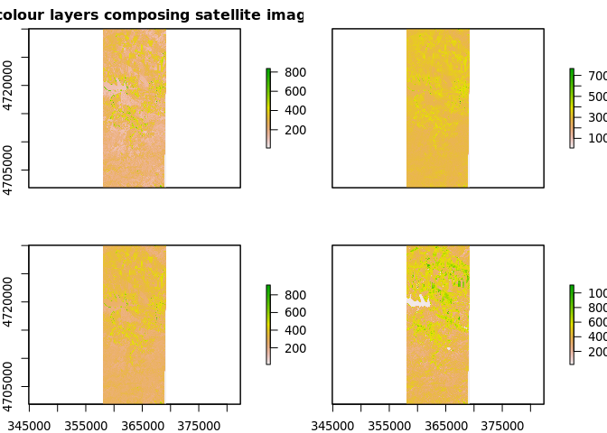<!-- -->

``` r
west %>% plot(add = T)
```

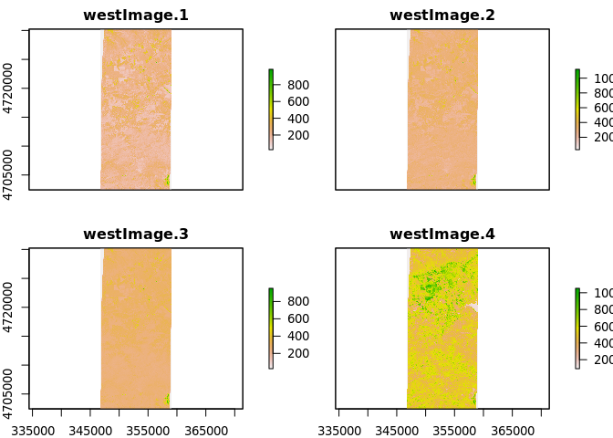<!-- -->

``` r
# visualizing only ROSE FIELDS on the satellite image based on the field work classification
east %>% plotRGB(main = "Visualizing only rose fields on the satellite image")
west %>% plotRGB(add =T)

kaz_units %>%
  filter(SU_LU == 2) %>%
  st_geometry() %>%
  plot(add = T)
```

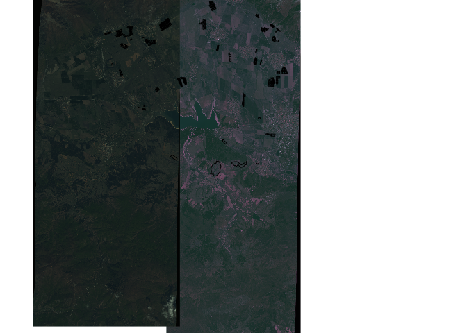<!-- -->

``` r
# listing all types of soil usage (10) - the explanation of level can be found in the sheet whose link is in the intro task
kaz_units$SU_LU %>% as.factor() %>% levels()
```

    ##  [1] "1"  "2"  "3"  "4"  "5"  "6"  "7"  "9"  "11" "12"

### Unsupervized Classification

``` r
# 
# # runing the unsupervized classification - telling the model to expect 10 distinct categories, use Lloyd algorithm, and increase iteratio up to 140 if necessary (default only 10, nstart), we got convergance issues
# test <- east %>% as.data.frame() %>% kmeans(10, algorithm = "Lloyd", iter.max = 140)
# 
# str(test)
# clusters <- raster(east)   ## create an empty raster with same extent than ICE
# clusters <- setValues(clusters, test$cluster) # convert cluster values into raster
# clusters
# 
# east %>% plotRGB()
# west %>% plotRGB(add = T)
# kaz_units %>% filter(SU_LU == 2) %>%  st_geometry() %>% plot(add = T)
# 
# 
# plot(clusters) 
# kaz_units %>% filter(SU_LU == 2) %>%  st_geometry() %>% plot(add = T)
# 
# plot(clusters)
# 
# unique(clusters)
# 
# zonal(east, clusters, fun = "mean")
# 
# mycolor <- c("#fef65b","#ff0000", "#daa520","#0000ff","#0000ff","#00ff00","#cbbeb5",
# "#c3ff5b", "#ff7373", "#00ff00", "#808080")
# 
# #par(mfrow = c(1,2))
# #east %>% plotRGB()
# 
# plot(clusters, main = 'Unsupervised classification')
# kaz_units %>% filter(SU_LU == 2) %>%  st_geometry() %>% 
#   plot
# 
# roses <- kaz_units %>% filter(SU_LU == 2)
# 
# st_union(roses)# %>% st_buffer(dist = 500) %>% st_geometry() %>% plot()
# 
# 
# test <- st_read("data/KAZ_surveyarea.shp")
# 
# test %>% st_geometry() %>% st_intersection() %>% plot()
# names(east)
```

### Supervised Classification

#### preparing the data for random forest

``` r
# visualizing all channels/layers of the raster data
hist(east,
     maxpixels = 10000,
     ylim = c(0,6000))
```

    ## Warning in .hist1(raster(x, y[i]), maxpixels = maxpixels, main = main[y[i]], :
    ## 0% of the raster cells were used. 10000 values used.
    
    ## Warning in .hist1(raster(x, y[i]), maxpixels = maxpixels, main = main[y[i]], :
    ## 0% of the raster cells were used. 10000 values used.
    
    ## Warning in .hist1(raster(x, y[i]), maxpixels = maxpixels, main = main[y[i]], :
    ## 0% of the raster cells were used. 10000 values used.
    
    ## Warning in .hist1(raster(x, y[i]), maxpixels = maxpixels, main = main[y[i]], :
    ## 0% of the raster cells were used. 10000 values used.

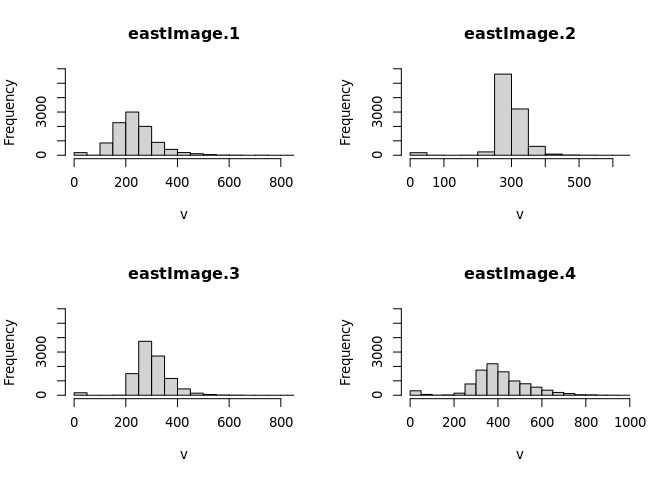<!-- -->

``` r
# calculating normalized vegetation index layer which helps to find live, green vegetation
ndvi <-
  overlay(
    east$eastImage.4,
    east$eastImage.3,
    fun = function(x, y) {
      (x - y) / (x + y)
    }
  )

## overlaying the vegetation index with classified data
plot(ndvi, main = "NDVI")

plot(ndvi, main = "NDVI overlayed with Areas classified in the field work")

kaz_units %>%
  st_geometry() %>%
  plot(col = kaz_units$SU_LU, add = T) %>%
  as.factor() %>%
  levels()
```

    ## character(0)

``` r
# combining all map layers (red, gree, blue, near infra red, NDVI, into one object which is used as a predictor/covariate/independent variable
covs <- stack(east, ndvi)

## renaming the layers to make sense of them
names(covs) <- c("blue", "green", "red", "near_infra_red", "NDVI")

# converting multipolygons of rose fields into raster so the model can make sense of it ()
SC_classes <-
  rasterize(kaz_units, ndvi, field = kaz_units$SU_LU, progress = "text")


# creating massk to hide all areas that weren't assigned a class during the field work so the model knows where to "learn"
SC_mask <- mask(covs, SC_classes)

## plotting the mask with satelite image
SC_mask %>% plotRGB(main = "Plotting satelite image of only classified data in the field work")

# adding classes into raster data
names(SC_classes) <- "class"
training_stack <- addLayer(SC_mask, SC_classes)

## plotting the five predictive layers and classes which is the "key"
plot(training_stack)
```

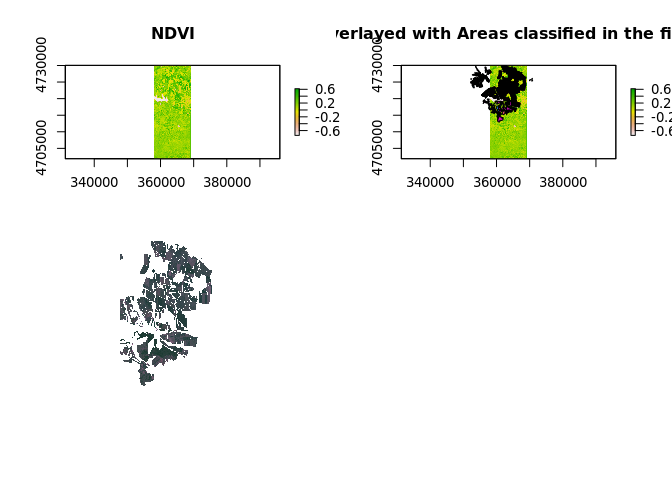<!-- -->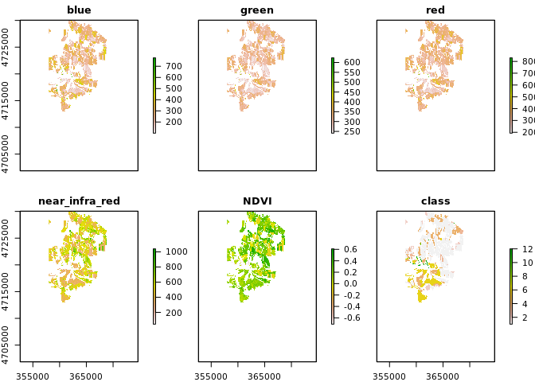<!-- -->

``` r
# converting raster into matrix
SC_matrix_train <- getValues(training_stack)

## dropping na
SC_matrix_train <- na.omit(SC_matrix_train)

# converting into a data frame
SC_df_train <- as.data.frame(SC_matrix_train)

# inspecting the data
head(SC_df_train)
```

    ##     blue  green    red near_infra_red      NDVI class
    ## 1 201.85 284.51 301.10         591.60 0.3254172     1
    ## 2 202.19 284.97 300.18         600.54 0.3334666     1
    ## 3 200.26 283.82 300.99         600.57 0.3322907     1
    ## 4 205.32 284.44 301.44         606.56 0.3360352     1
    ## 5 206.66 286.44 300.73         591.20 0.3256646     1
    ## 6 205.63 284.25 301.39         597.84 0.3296709     1

``` r
tail(SC_df_train)
```

    ##          blue  green    red near_infra_red       NDVI class
    ## 685143 304.43 335.19 356.70         386.19 0.03969631     6
    ## 685144 306.34 331.47 351.94         400.76 0.06485985     6
    ## 685145 285.23 326.69 344.76         397.33 0.07084043     6
    ## 685146 276.31 323.68 340.42         422.65 0.10776204     6
    ## 685147 285.79 325.36 341.80         404.89 0.08449293     6
    ## 685148 297.07 333.13 349.85         387.82 0.05147288     6

``` r
# changing the class column into a factor (integer implies an order which is undesirable in our case)
SC_df_train$class <- SC_df_train$class %>% as.factor()

## 10 different land uses
SC_df_train$class %>% levels()
```

    ##  [1] "1"  "2"  "3"  "4"  "5"  "6"  "7"  "9"  "11" "12"

#### training the model and classifying the entire east

Because the model took over 30 minutes to run and its size is 760 MB
(740 MB in zipped format), are saving model’s output and commenting out
the code. It al means you cannot just load the files you markdown must
suffice.

``` r
# Models's formula
##  soil class ~ red, green, blue, near infra red, NDVI

#modelRF <- randomForest(x=SC_df_train[ ,c(1:5)], y=SC_df_train$class,
#                        importance = TRUE)

# saving model's output
#saveRDS(modelRF, "modelRF.rds")

# reading model's file
modelRF <- readRDS("modelRF.rds")

# model's matrix which informs us how many pixels were assigned to a given category
modelRF$confusion
```

    ##         1    2    3     4   5     6   7 9 11   12 class.error
    ## 1  361271 4469 1958 19565  43  5523  75 2  1   98  0.08074706
    ## 2   19714 8692  204  4385   8  2994  45 0  0    3  0.75885698
    ## 3   10642  273 2913  4501   3   684   5 0  0   11  0.84694199
    ## 4   43429 1383  956 57267  77 11941 143 5  2  274  0.50408306
    ## 5     507   24   26   344 217   407  26 0  0    8  0.86080821
    ## 6   14024  962  403 12603  36 82479  38 2  0  196  0.25522155
    ## 7     373   93   15   594  35   232 492 1  0  179  0.75571003
    ## 9      54    2    2   370   0    22   1 2  0    0  0.99558499
    ## 11     13    3    0    27   0     1   0 0  0    0  1.00000000
    ## 12    597   17    6   248   6   119 118 0  0 5665  0.16396104

``` r
# Mean decrease accuracy  expresses how much accuracy the model losses by excluding each variable -> the NDVI along with green specter was the least informative layer, while the red and near infrared the most
varImpPlot(modelRF)
```

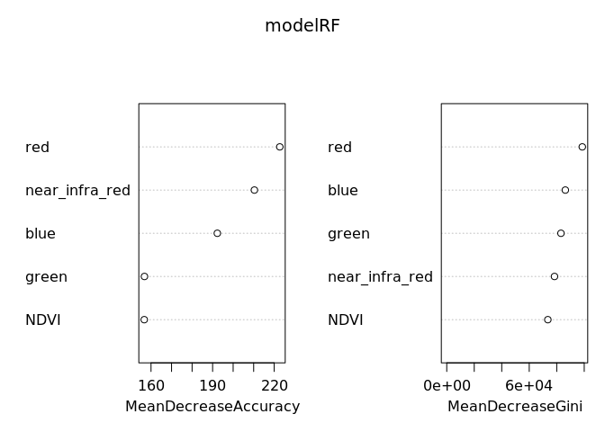<!-- -->

``` r
# now we let the model predict classes for the entire east part of the valley
#predLC <- predict(covs, model=modelRF, na.rm=TRUE)

#saveRDS(predLC, "predLCF.rds")
predLC <- readRDS("predLCF.rds")

# for better interpretability, we assign labels to the integers
field_types <-
  c(
    "Annual Agriculture",
    "Rose Field",
    "Fallow field",
    "Pasture",
    "Scrub",
    "Forest",
    "Wetland",
    "Burnt",
    "Communication",
    "Beach"
  )

#You have too zoom all the way to see the zones, and even then it's almost not enough...
plot(predLC,
     col = brewer.pal(10, "Set3"),
     legend = F,
     main = "Land use assigned to the East by the Model")

kaz_units %>%
  st_geometry() %>%
  plot(add =  T)

legend(
  "bottomright",
  legend = field_types,
  fill = brewer.pal(10, "Set3"),
  bg = "white"
)
```

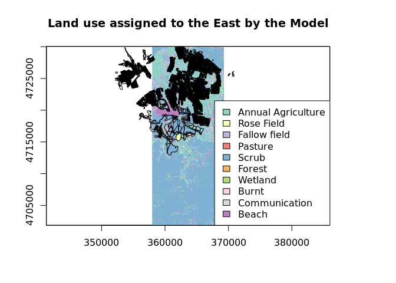<!-- -->

#### Testing on the west and final plotting

``` r
# again calculating vegetation normalized index for the west part
ndvi_w <-
  overlay(
    west$westImage.4,
    west$westImage.3,
    fun = function(x, y) {
      (x - y) / (x + y)
    }
  )

# stakcking all layers layes into one object
covs_w <- stack(west, ndvi_w)

## renaming the layers
names(covs_w) <- c("blue", "green", "red", "near_infra_red", "NDVI")

# converting multipolygons of rose fields into raster
SC_classes_w <-
  rasterize(kaz_units,
            ndvi_w,
            field = kaz_units$SU_LU,
            progress = "text")


# classifying the west part by the model
#predLC_w <- predict(covs_w, model=modelRF, na.rm=TRUE)

## saving and reading model's output, in
#predLC_w <- saveRDS(predLC_w, "predLC_w.rds")
predLC_w <- readRDS("predLC_w.rds")

##ploting the west part
plot(predLC_w,
     col = brewer.pal(10, "Set3"),
     legend = F,
     main = "Land use assigned to the West by the Model")
kaz_units %>% st_geometry() %>%  plot(add =  T)

legend(
  "bottomleft",
  legend = field_types,
  fill = brewer.pal(10, "Set3"),
  bg = "white"
)
```

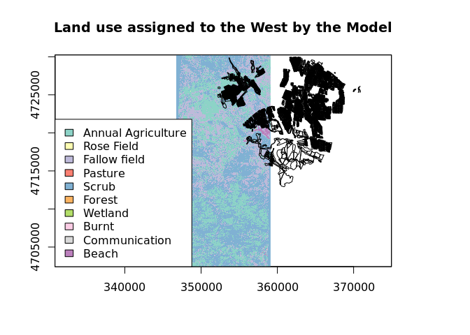<!-- -->

``` r
## plotting the east and west together
plot(predLC_w,
     col = brewer.pal(10, "Set3"),
     legend = F,
     main = "Land use assigned by the Model")

plot(predLC,
     col = brewer.pal(10, "Set3"),
     legend = F,
     add = T)

legend(
  "bottomleft",
  legend = field_types,
  fill = brewer.pal(10, "Set3"),
  bg = "white"
)
```

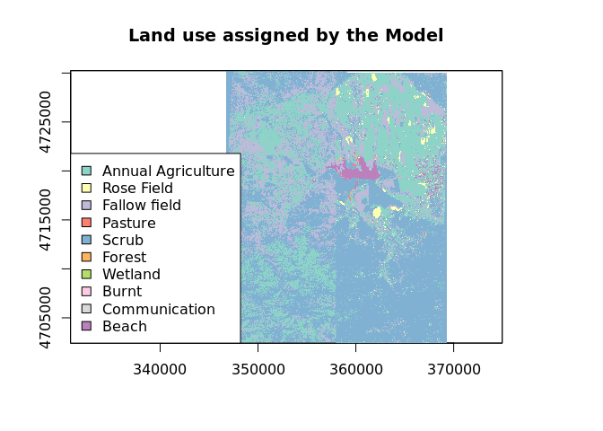<!-- -->

``` r
## classified east and west with marked ross field from the field work
plot(predLC_w,
     col = brewer.pal(10, "Set3"),
     legend = F,
     main = "Land use assigned by the Model with Marked Rose Field")
plot(predLC,
     col = brewer.pal(10, "Set3"),
     legend = F,
     add = T)

kaz_units %>%
  filter(SU_LU == 2) %>%
  st_geometry() %>%
  plot(add =  T)


legend(
  "bottomleft",
  legend = field_types,
  fill = brewer.pal(10, "Set3"),
  bg = "white"
)
```

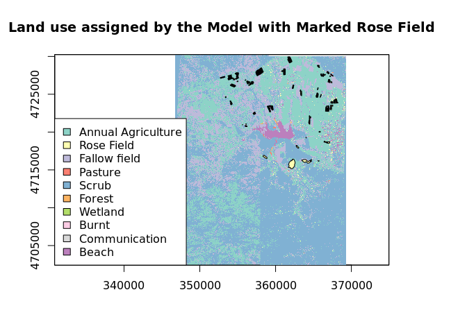<!-- -->

``` r
## classified east and west with marked all land usage gained trhough the field work
plot(predLC_w,
     col = brewer.pal(10, "Set3"),
     legend = F,
     main = "Land use assigned by the Model + field work classification on top")

plot(predLC,
     col = brewer.pal(10, "Set3"),
     legend = F,
     add = T)

kaz_units %>% st_geometry() %>%  plot(add =  T)

legend(
  "bottomleft",
  legend = field_types,
  fill = brewer.pal(10, "Set3"),
  bg = "white"
)
```

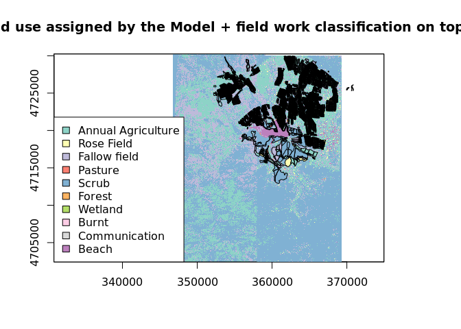<!-- -->
\#\#\# Conclusion  
As you can see in the map, besides the larger areas of rose field which
were used for model training, there are only a few tiny spots here and
there where the roses grow in the west part, while the east is just a
annual agriculture and scrub. And now, let’s discredit our conclusion.

No matter how nice the visualizations are, it cannot hide the fact that
it is a crap. First, you can see a clear dividing line between east and
west data in the southern part and how the land use abruptly changes
just by the change of map.Also, when looking at the map map division
around lake, it seems that some part are visualized twice. Also,
interestingly enough, when we plot on the east map with a layer of rose
fields marked from the field work, the two maps seem to be misaligned no
matter how much we play around with their crs. When plotted on the map
of east and west combined, it works just fine. Lastly, when looking at
the east and west map, the overall colour seems to be quite different.
Perhaps that could also explain why the model did a poor job especially
on the west part. Secondly, given that the model took 30 minutes to run,
we did not have time to re run it multiple times and play around with
parameters (map layers)to get the most out of the model. Annoyingly, the
package we used for RF-modeling did not support parallel computing, so
we had no way to shorten the computing time either. Ideally, we would
have time to properly split the data into training, validation and test
sets to find and evaluate the model. We wonder if this could have been
performed easier with packages such as caret or tidymodels. Third, the
process of categorization was done on the basis winner takes it all.
E.g., when a given area consisted from 60 % of scrub and 40 % of beach,
it would be noted down as a scrub. Such discrepancies highly impact
learning process of the model. Fourth, there was a time discrepancy
between the satellite image and field work of 10 years. Furthermore, we
can imagine that the season in which the satellite images were taken
would have a huge impact on the classification as well.

It was a nicely challenging assignment:)
